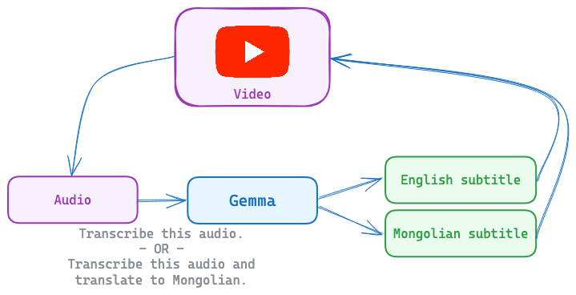

\> *Write-Up of the "Google - The Gemma 3n Impact Challenge" hackathon on Kaggle*

<iframe width="560" height="315" src="https://www.youtube.com/embed/LayUFbTfEqQ?si=ENcLFBKROqFpkN3G" title="YouTube video player" frameborder="0" allow="accelerometer; autoplay; clipboard-write; encrypted-media; gyroscope; picture-in-picture; web-share" referrerpolicy="strict-origin-when-cross-origin" allowfullscreen></iframe>

 

Our team working on an automatic subtitle generator that creates bilingual subtitles for English and Mongolian languages, addressing the critical under representation of Mongolian in AI language models. By fine-tuning Google's Gemma 3n E2B model with LoRA (Low-Rank Adaptation), we are developing solution that operates offline while providing real-time transcription and translation between both languages. Currently, we have only fine-tuned the model; the demo app is still in development.

## The Challenge

Mongolia's 3.3 million speakers face significant barriers accessing global digital content due to lack of Mongolian language support in mainstream AI tools. Traditional subtitle generation services exclude low-resource languages like Mongolian, creating accessibility gaps that limit educational opportunities and cultural exchange. Even advanced multimodal models like Gemma 3n E2B show very limited capabilities for Mongolian audio processing out-of-the-box, highlighting the urgent need for specialized fine-tuning approaches.

## Our Solution

We are building a comprehensive subtitle generation system that generates accurate subtitles in both English and Mongolian from audio/video content, operates completely offline using our fine-tuned model, and provides bidirectional translation with an intuitive web interface for video upload and playback.

This will transform educational access by enabling students in rural Mongolia to access international content with native language subtitles, while supporting language learners with parallel subtitle exposure. It preserves and promotes cultural exchange by making Mongolian content accessible to global audiences and international media consumable locally.

## Technical Implementation

### Dataset and Training Strategy

We assembled a comprehensive multilingual audio-text dataset combining four key sources:

- **MBSpeech**: Native Mongolian audio from biblical recordings paired with Mongolian text, establishing strong monolingual foundations bilguun/mbspeech.
- **TED Talks**: High-quality English audio with parallel English and Mongolian subtitles, creating crucial cross-lingual alignment data ([bilguun/ted_talks_en_mn_split](https://huggingface.co/datasets/bilguun/mbspeech) - split `en`).
- **TEDxUlaanbaatar**: Mongolian audio with native subtitles and machine-translated English versions using Gemini 2.5 Flash ([bilguun/ted_talks_en_mn_split]() - split mn).
- **Mozilla Common Voice Mongolian**: Diverse speaker demographics and recording conditions to improve robustness (mozilla-foundation/common_voice_17_0 - mn subset).

Our training approach leveraged multi-task learning with nine different instruction templates:

- **Simple transcription**: "Transcribe this audio"
- **Language-specific transcription**: "Transcribe this audio into Mongolian/English"
- **Cross-lingual translation**: "Translate this audio into Mongolian/English"
- **Combined tasks**: "Transcribe this audio into English, and then translate it into Mongolian"

The system randomly selects instructions during training, enabling the model to handle diverse real-world scenarios from simple transcription to complex bilingual tasks.

### Model Architecture and Fine-tuning

We fine-tuned Google's Gemma 3n E2B model using LoRA (Low-Rank Adaptation) with the following configuration:

- **LoRA Parameters**: Rank 32, alpha 64, targeting all attention and feed-forward projection layers
- **Efficiency**: Required only 2% of original parameters while maintaining full model capabilities
- **Training Setup**: Mixed precision (bfloat16) with 8-step gradient accumulation
- **Audio Processing**: 16kHz sampling rate through built-in audio encoder
- **Token Masking**: Special handling for audio, image, and padding tokens during loss computation

Training specifications:

- **Duration**: 2 epochs with learning rate of 2e-4
- **Memory Management**: Gradient checkpointing for efficient training
- **Batch Sizes**: 2 per device with 8x gradient accumulation (effective batch size of 16)

## Result

The base Gemma 3n E2B model showed very limited Mongolian audio transcription capabilities, but our fine-tuned version demonstrates significant improvements with competitive performance on Mongolian speech recognition while maintaining strong English capabilities. However, translation quality between languages shows improvement from the base model but remains poor and requires further refinement in future iterations. Training completed in approximately 4 hours on a single RTX 4090 GPU, making the approach accessible for resource-constrained research environments. The system achieves real-time processing speeds suitable for live applications.

Fine-tuned model is available on HuggingFace: [bilguun/gemma-3n-E2B-it-audio-en-mn](https://huggingface.co/bilguun/gemma-3n-E2B-it-audio-en-mn)

Training code is available at: [gemma3n-audio-mn](https://github.com/bilguun0203/gemma3n-audio-mn)
