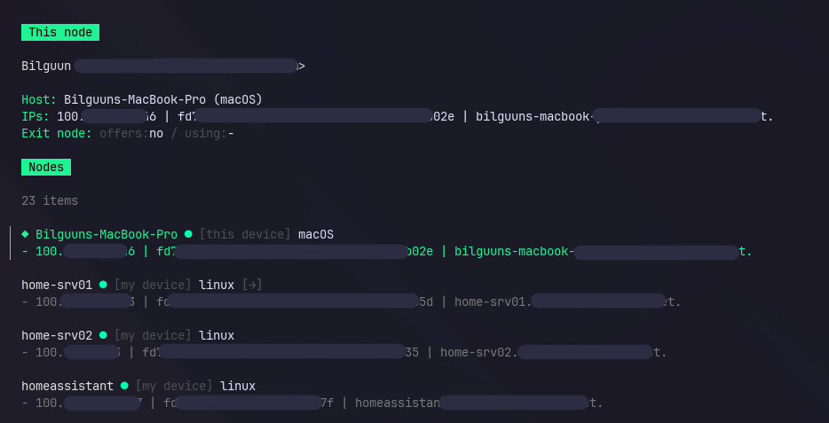

Өөрийн Tailscale сүлжээн доторх node-н жагсаалт болон тэдгээрийн төлвийг терминал дотроо текст интерфэйсээр (TUI) харах боломжтой апп.

```sh
go install github.com/bilguun0203/tailscale-tui@latest
```


